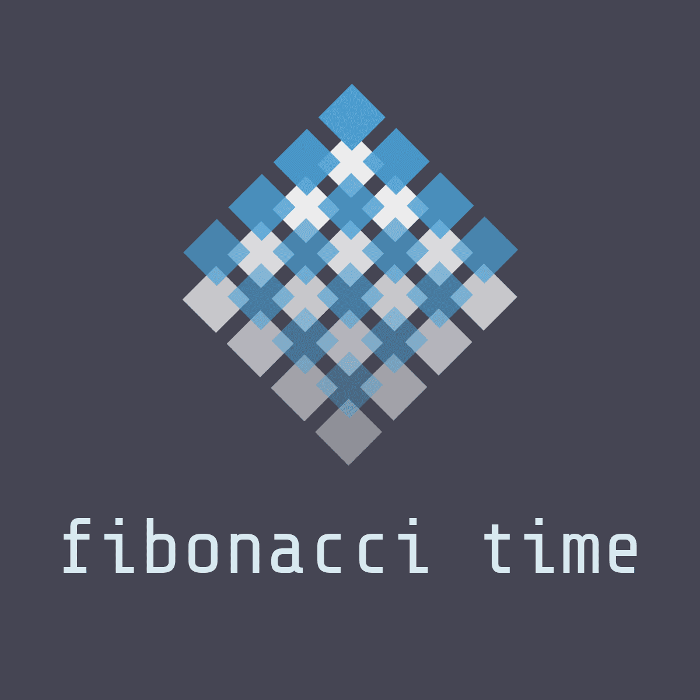

# fibonacciClock

  

JavaScript implementation of the Fibonacci  clock created by [Philippe Chrétien ](http://basbrun.com/). There are many others, but this one is [mine](https://www.fibonaccitime.com).
